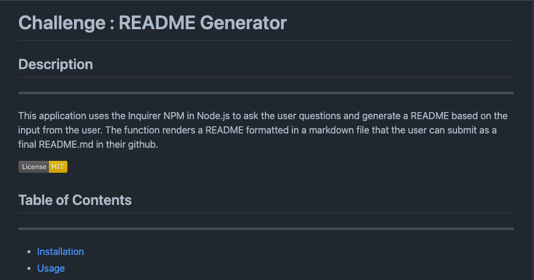

# Challenge : README Generator

## Description

This application uses the Inquirer NPM in Node.js to ask the user questions and generate a README based on the input from the user. The function renders a README formatted in a markdown file that the user can submit as a final README.md in their github.

[](https://opensource.org/licenses/MIT)

## Table of Contents

- [Installation](#installation)
- [Usage](#usage)
- [License](#license)
- [Contributing](#contributing)
- [Tests](#test-instructions)
- [Questions](#questions)
## Installation

Users should have access to Node.js in order to be able to interact with the file and input their responses.
## Usage

Once Node.js is installed, users should navigate to the file and enter "node index.js". A README.md will then be generated based on the input from the user.
```
.then((answers) => {
        const fileContent = generateMarkdown(answers);
        fs.writeFile("generatedREADME.md", fileContent, (err) =>
        err ? console.log(err) : console.log ("README file created.")
        );
```

This code uses the input from the inquirer responsed and then generates the README.md based on the input from the user. The README.md also contains a section for all of the sections of a professional README.md, a license badge, a table of contents that takes the user to that section of the README.md, and a contact section that includes the users github profile link and email.
## License
---
This application is covered under the MIT License
## Contributing
None
## Test Instructions

None

## Questions

https://github.com/overtonr

If you have any questions, please feel free to contact me through my email : overton.rm@gmail.com.